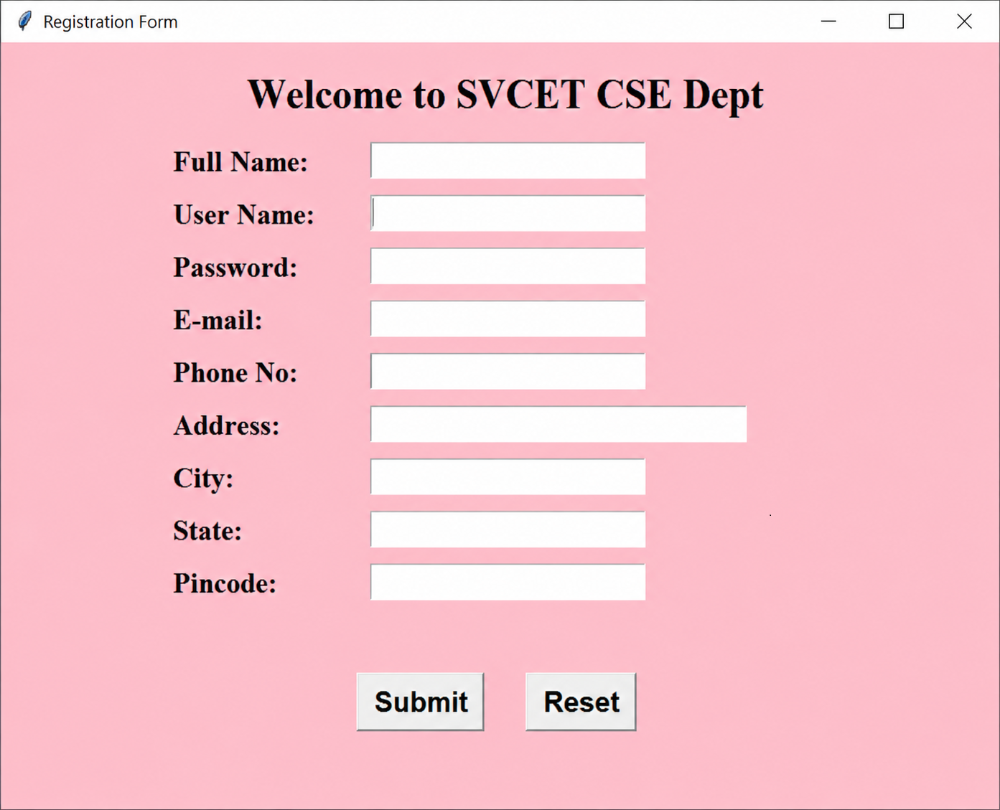

# Tkinter Registration Form

A simple GUI-based Registration Form developed using **Python Tkinter**. This project demonstrates how to create a user-friendly desktop application with input fields, buttons, labels, and basic form controls.

## Technologies Used

* Python
* Tkinter

## Features

* Full Name
* User Name
* Password
* E-mail
* Phone Number
* Address
* City
* State
* Pincode
* Gender selection
* Department selection
* Submit Button
* Reset Button
* Simple and user-friendly GUI

## Project Structure

```text
Tkinter-Registration-Form/
│
├── registration_form.py
├── output.png
└── README.md
```

## GUI Components Used

### Tkinter Window

`Tk()` creates the main application window.

```python
window = Tk()
```

### Window Configuration

The main window can be configured using properties such as:

```python
window.geometry("...")
window.title("Registration Page")
window.config(bg="...")
```

* `geometry()` – Sets the size of the window.
* `title()` – Sets the window title.
* `config()` – Configures properties such as the background color.

### Widgets Used

#### Label

`Label()` is used to display text such as:

* Welcome message
* Full Name
* Username
* Password
* Email ID
* Phone Number
* Address
* City
* State
* Pincode
* Gender
* Department

#### Entry

`Entry()` is used to accept user input.

Examples include:

* Username
* Password
* Email
* Phone Number
* Address
* Pincode

For password fields, the input can be hidden using the `show` property.

```python
Entry(window, show="*")
```

#### Button

`Button()` is used to perform actions.

The project includes:

* **Submit Button** – Submits the entered registration information.
* **Reset Button** – Clears the input fields.

#### Place

`place()` is used to position widgets at specific X and Y coordinates.

```python
widget.place(x=100, y=50)
```

#### Font

The `font` property is used to customize the appearance of text.

```python
font=("Arial", 12)
```

## Widget Summary

| Widget     | Purpose                 |
| ---------- | ----------------------- |
| `Tk()`     | Creates the main window |
| `Label()`  | Displays text           |
| `Entry()`  | Accepts user input      |
| `Button()` | Performs actions        |
| `place()`  | Positions widgets       |
| `font`     | Controls text style     |

## Output



## How to Run

1. Install **Python** on your computer.
2. Download or clone this repository.
3. Open the project folder in VS Code or Command Prompt.
4. Make sure `registration_form.py` is present.
5. Run the following command:

```bash
python registration_form.py
```

The Tkinter registration form window will open.

## Learning Outcomes

Through this project, you can learn:

* Python GUI development.
* Basics of Tkinter.
* Creating and arranging widgets.
* Taking user input using `Entry`.
* Creating buttons and assigning actions.
* Designing a simple desktop application.
* Handling form reset and submission operations.

## Future Improvements

* Connect the registration form to a MySQL database.
* Add input validation.
* Add email and phone-number validation.
* Display registration success messages.
* Add login functionality.
* Improve the GUI design with themes and images.

## Author

**Kammineni Venkata Manasa**

Developed as a Python Tkinter GUI project.

